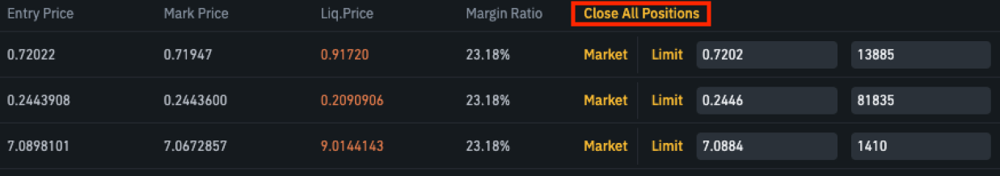
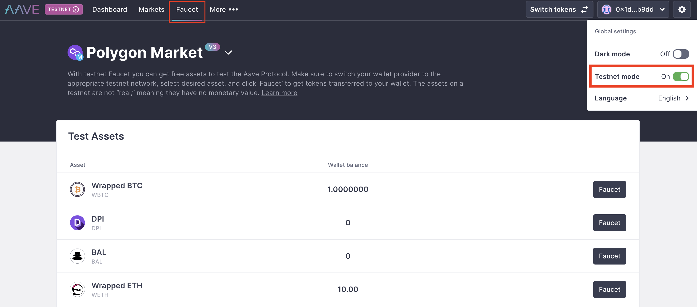

# LEVER-EZ: Empowering Degens in Multichain DeFi

## Overview

In the dynamic realm of decentralized finance (DeFi), the quest for alpha yields across multiple blockchains has never been more challenging and rewarding. Enter LEVER-EZ, a pioneering project tailored for decentralized enthusiasts, affectionately known as "degens." In the ever-expanding DeFi landscape, degens navigate diverse chains, seeking opportunities in Decentralized Exchanges (DEXs), Lending Protocols, and Blockchains. LEVER-EZ is designed to empower these degens by providing an automated solution for flashloan looping, optimizing gas consumption and unlocking the potential for alpha yields within limited budgets.

## Target Audience

LEVER-EZ is crafted for degens who actively pursue airdrop opportunities and yield farming strategies. In the midst of bullish market conditions, these degens are strategically positioned to leverage their assets effectively, identifying hidden opportunities and maximizing returns.

## Prerequisites

- [Git](https://git-scm.com/book/en/v2/Getting-Started-Installing-Git)
- [Current LTS Node.js version](https://nodejs.org/en/about/releases/)

## Getting Started

1. Install packages

```
npm install
```

2. Compile contracts

   If this the first time you compile the codes, you should comment the `import "./tasks";` in the [`hardhat.config.ts`](./hardhat.config.ts)

```
npx hardhat compile
```

## Key Features

LEVER-EZ offers a comprehensive suite of features, including:

- **Flashloan Looping:** Automated and optimized for gas consumption, allowing degens to navigate the DeFi landscape efficiently.
- **Collateral Status Insights:** Provides a real-time view of collateral statuses across various DeFi lending protocols.
- **On-Chain Valuations:** Utilizes Chainlink Data to present on-chain valuations of assets within each blockchain.
- **Black Swan Event Management:** Enables users to swiftly close all positions across multiple chains in unforeseen events, mitigating risks effectively.

## Functionality

The LEVER-EZ project serves as a practical guide, showcasing how users can interact with leading lending protocols such as Compound V2, Aave V2, and Aave V3. Users can seamlessly leverage, deleverage, supply, withdraw, and manage their assets, ensuring a strategic approach to decentralized finance.

## Chainlink CCIP Integration

At the heart of LEVER-EZ is the **Chainlink Cross-Chain Interoperability Protocol (CCIP)**, a powerful tool facilitating seamless communication across diverse blockchains.


In critical scenarios, mirroring the urgency seen in traditional markets, users can leverage functionalities similar to "close all positions" buttons found in centralized exchange derivatives/margin markets.



The Leverager contract within LEVER-EZ inherits CCIP receiver contract. With Chainlink CCIP integration, users gain unparalleled capabilities:

- **Supply and Borrow:** Swiftly supply and borrow tokens within lending protocols.
- **Leveraged Yielding Positions:** Open positions combining supply and borrow operations for optimized yields.
- **Token Management:** Seamlessly withdraw or borrow tokens as per strategic requirements.
- **Position Closure:** Close leveraged yielding positions partially or entirely, managing risk dynamically.
- **Multichain Position Closure:** Execute a single transaction to close all positions across multichain lending protocols in the same address.

## Usage

We modified the example repository from Chainlink [`ccip-cross-chain-nft`](https://github.com/smartcontractkit/ccip-cross-chain-nft/tree/main) and remained the basic usage docs.

We are going to use the [`@chainlink/env-enc`](https://www.npmjs.com/package/@chainlink/env-enc) package for extra security. It encrypts sensitive data instead of storing them as plain text in the `.env` file, by creating a new, `.env.enc` file. Although it's not recommended to push this file online, if that accidentally happens your secrets will still be encrypted.

1. Set a password for encrypting and decrypting the environment variable file. You can change it later by typing the same command.

```shell
npx env-enc set-pw
```

2. Now set the following environment variables: `PRIVATE_KEY`, Source Blockchain RPC URL, Destination Blockchain RPC URL. You can see available options in the `.env.example` file:

```shell
ETHEREUM_SEPOLIA_RPC_URL=
OPTIMISM_GOERLI_RPC_URL=
ARBITRUM_TESTNET_RPC_URL=
AVALANCHE_FUJI_RPC_URL=
POLYGON_MUMBAI_RPC_URL=
```

To set these variables, type the following command and follow the instructions in the terminal:

```shell
npx env-enc set
```

After you are done, the `.env.enc` file will be automatically generated.

If you want to validate your inputs you can always run the next command:

```shell
npx env-enc view
```

### Faucet

Quicknode provides **0.1 ETHSepolia / 1 Mumbai Matic / 0.2 Fuji Avalanche per day** if you have the accounts or make the accounts.

Infura provides **0.5 ETHSepolia per day** if you have the accounts.

Alchemy provides **0.5 ETHSepolia 0.5 Mumbai Matic per day**.

Chainlink provides **20 LINK token per day in each chain**.

[Sepolia](https://www.infura.io/faucet/sepolia)
[Mumbai](https://mumbaifaucet.com/)
[Fuji](https://faucet.quicknode.com/avalanche/fuji)
[Chainlink](https://faucets.chain.link/sepolia)


[Aave](https://app.aave.com/faucet/) provides the mintable ERC20 tokens for testnet environments.

### User assumptions

Due to transferring the tokens, depositing as a collaterals and borrowing on behalf of the someone, we need many steps to follow to make enable to do all of functions.

To minimize the complexity of contracts for the hackathons, we assumed the users as follows

- Who has already supplied to the aaveV2 / V3 lending pools before and hasn't disabled the assets as collaterals.
- Who supplies and borrows( **leverage** / **deleverage** ) in the same assets.

### Get Info

```shell
npx hardhat lending-status --blockchain ethereumSepolia
```

### Test

```shell
npx hardhat test (--v / --vv / --vvv / --vvvv)
```

### Deployment

1. Deploy the [`Leverager.sol`](./contracts/Leverager.sol) smart contracts to the **all target blockchains**, by running the `deploy-leverager` task:

```shell
npx hardhat deploy-leverager
--router <routerAddress> # Optional
```

For example, if you want to mint Leverager on avalancheFuji, run:

```shell
npx hardhat deploy-leverager --network avalancheFuji
```

2. Replace the values of leveragerAddress and propagatorAddress in [`constants.ts`](./tasks/constants.ts)

```shell
export const leveragerAddress: AddressMap = {
  [`ethereumSepolia`]: `0x5e96230EB452667C44200F4b6e3D9F3FE962174c`,
  [`polygonMumbai`]: `0x0020eb0e3d5E938129201d2e146748691Ee3261B`,
  [`avalancheFuji`]: `0x5ccC154987a3c144F1F1fAD2F6Cf62ebAA716307`,
};

export const propagatorAddress: AddressMap = {
  [`ethereumSepolia`]: `0xA13793E2aAb6bf797ccd3Ee23F730aDa6B1F231D`,
  [`polygonMumbai`]: `0x0F94C6130941aB0A71BC877557d5894C7FCA4A90`,
  [`avalancheFuji`]: `0x6Fe63802623a87420F4a25c1642ACCd33da224F0`,
};
```

3. After depolying all of testnets, enroll the propagator of each source chain to leverager

```shell
npx hardhat add-chainselector-propagator --network ethereumSepolia
```

### Fee Management

4. Fund the [`Propagator.sol`](./contracts/Propagator.sol) smart contract with native tokens for CCIP fees.

- If you want to pay for CCIP fees in Native tokens:

  Open Metamask and fund your contract with Native tokens. For example, if you want to mint from Ethereum Sepolia to Avalanche Fuji, you can send 0.01 Sepolia ETH to the [`Propagator.sol`](./contracts/Propagator.sol) smart contract.

  Or, you can execute the `fill-sender` task, by running:

```shell
npx hardhat fill-sender --blockchain <blockchain> --amount <amountToSend> --pay-fees-in <Native>
```

For example, if you want to fund it with 0.01 Sepolia ETH, run:

```shell
npx hardhat fill-sender --blockchain ethereumSepolia --amount 10000000000000000 --pay-fees-in Native
```

- If you want to pay for CCIP fees in LINK tokens:

  Open Metamask and fund your contract with LINK tokens. For example, if you want to mint from Ethereum Sepolia to Avalanche Fuji, you can send 0.001 Sepolia LINK to the [`SourceMinter.sol`](./contracts/cross-chain-nft-minter/SourceMinter.sol) smart contract.

  Or, you can execute the `fill-sender` task, by running:

```shell
npx hardhat fill-sender
--blockchain <blockchain>
--amount <amountToSend>
--pay-fees-in <LINK>
```

For example, if you want to fund it with 0.001 Sepolia LINK, run:

```shell
npx hardhat fill-sender --blockchain ethereumSepolia --amount 1000000000000000 --pay-fees-in LINK
```

### Approve

5. Approve ERC20 based tokens to the leverager.

There are mainly 7 functions in the leverager contract. To enable the functions, it requires following assets' approval.

1. Supply

   **approve** | underlyingAsset

2. Leverage supply

   **approve** | underlyingAsset / CToken(Compound)

   **approveDelegate** | DebtToken(Aave)

3. Withdraw

   **approve** | aToken(Aave) / CToken(Compound)

4. Borrow

   **approve** | CToken(Compound)
   **approveDelegate** | DebtToken(Aave)

5. Close(Repay)

   **approve** | underlyingAsset

6. Close(Deleverage)

   **approve** | underlyingAsset
   **approve** | aToken(Aave) / CToken(Compound)

7. Close(Close All)

   **approve** | underlyingAsset/ aToken(Aave) / CToken(Compound) in each chain
   **funded propagator** in each chain

### Transaction History

[Supply](https://testnet.snowtrace.io/tx/0xa94e231a9325229c8b6e40af8e837c15c7a80dca71c8c55860a1db6542d3bf5e?chainId=43113)

[Leverage Supply](https://testnet.snowtrace.io/tx/0x05aab9f21759be13074376a8c1c15940fa3334776dd3611fdbb8fe09b6d7a3ae?chainId=43113)

[Withdraw](https://testnet.snowtrace.io/tx/0xa01f1548a019b074c158acd2b6620ead74ca295a9ddc1b1ea6f35a0cc27d80fb?chainId=43113)

[Borrow](https://testnet.snowtrace.io/tx/0xa6c9cdeb388ca5b3bd2d163a6799efdb51b6d046e838687f696e488dc51bd658?chainId=43113)

[Close(Repay)](https://testnet.snowtrace.io/tx/0x1df5eb93b38f2e1a2658fce76c6fa80ced65e0ae9acfb8a874c5e48bbec7c675?chainId=43113)

[Close(Deleverage)](https://testnet.snowtrace.io/tx/0x6994bd4f2271b06377eb93546dcda6232fc32d5a15cc8f5aa6829d440161f4ee?chainId=43113)
